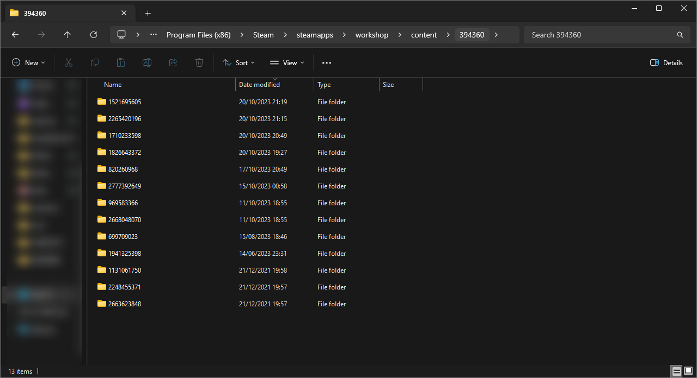

# Ultimate-God-Mode
## Welcome!
You may have come here from the [Steam workshop](https://steamcommunity.com/sharedfiles/filedetails/?id=1710233598) on the Ultimate God Mode mod. This is a guide on how to make Ultimate God Mode work on any overhaul mod such as Millennium Dawn, Equestria at War, etc. 
### NOTE!:
As the methods used will require you to move and replace files, this will effectively change the overhaul mod that you have installed. This means that once the process is done, it cannot be reverted unless you reinstall the overhaul mod! [Read more at the bottom of this guide...](https://github.com/kaa-hong/Ultimate-God-Mode/tree/main#how-do-i-play-the-overhaul-mod-without-ultimate-god-mode)

## Let's get started!
### Step 1. Open Ultimate God Mode's mod folder
To start with go to the steam workshop content folder, all mods including Ultimate God Mode and the overhaul ones are in there:
C:\Program Files (x86)\Steam\steamapps\workshop\content\394360

All mod file names correspond with their steam workshop IDs, first open Ultimate God Mode, which is under the folder '1710233598'.

### Step 2. Open the files to any overhaul mod
Next on a new window, open the mod files to the target overhaul mod. The folder names correspond with the steam workshop ID of the mod. In this guide, I will be opening Equestria at War's files (1826643372).

The file path is the same as the previous step but make sure another window is opened.

A few notable overhaul mods can be identified with these folder names (IDs):
* [2777392649](https://steamcommunity.com/sharedfiles/filedetails/?id=2777392649) - Millennium Dawn;
* [1826643372](https://steamcommunity.com/sharedfiles/filedetails/?id=1826643372) - Equestria at War;
* [2265420196](https://steamcommunity.com/sharedfiles/filedetails/?id=2265420196) - Old World Blues;

You can always find the IDs by going to the mod's steam workshop page and looking at the URL, or use trial and error by opening all the folders to identify them.

### Step 3. Move Ultimate God Mode's files into the overhaul mod files
The third and final step is to copy and paste Ultimate God Mode's files into the overhaul mod. **Please make sure you copy and paste, otherwise, Ultimate God Mode's files will disappear!** Also only copy and paste the three folders NOT including the 'descriptor.mod' and 'thumbnail.png'.

Now your game is ready to play! You may disable Ultimate God Mode on the launcher, as it is already included in the overhaul mod.

## How do I play the overhaul mod without Ultimate God Mode?
Because you have moved Ultimate God Mode into the overhaul mod, the overhaul mod will now only be playable with Ultimate God Mode. To fix this and revert everything back to normal you can either:
* Reinstall the overhaul mod from the Steam Workshop by unsubscribing then subscribing.
* Wait for an update for the overhaul mod (Updates from overhaul mods will remove Ultimate God Mode automatically) - Yes this means you'll have to repeat this process again if you want to play with UGM.
* Locate and identify Ultimate God Mode's files in the overhaul mod's files and remove them manually.

You can also do something to counter this issue before doing this whole process, which is by creating a local mod file and placing both mod's files inside. This is a more technical approach, so if you have some knowledge on how and where files are meant to be placed then go ahead. This will need to be regularly repeated to keep up with updates on both mods.
